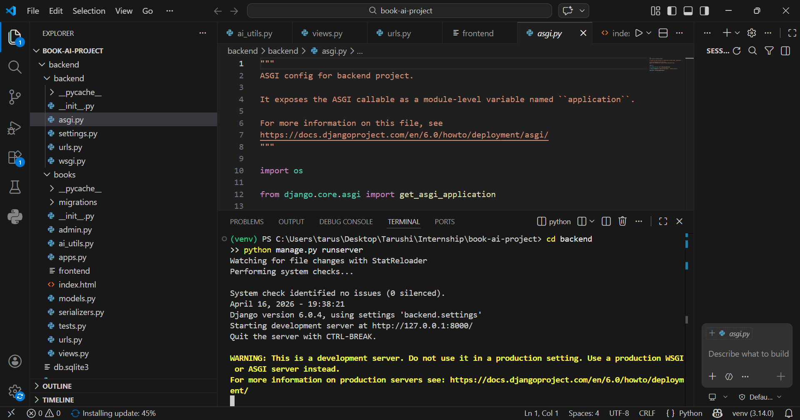
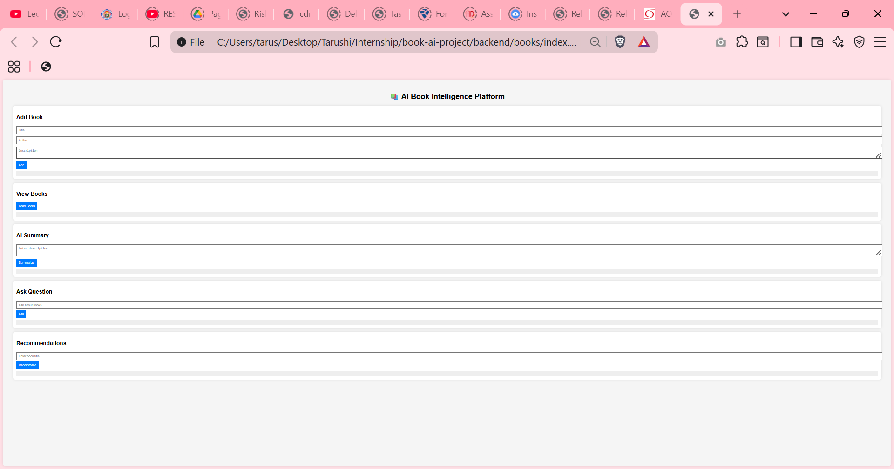
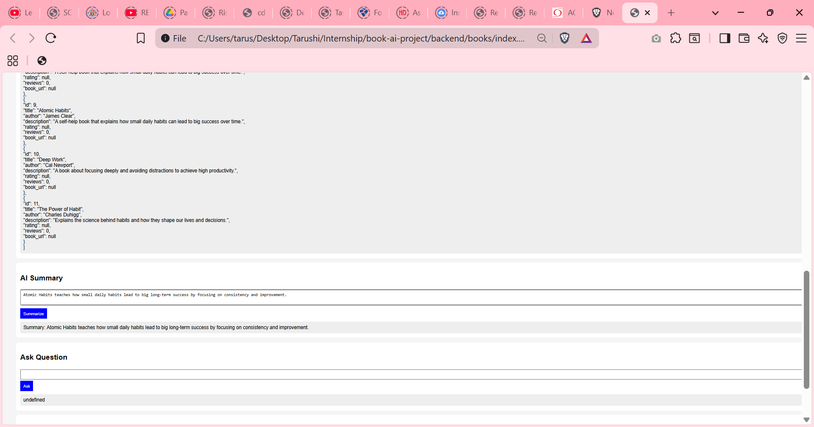
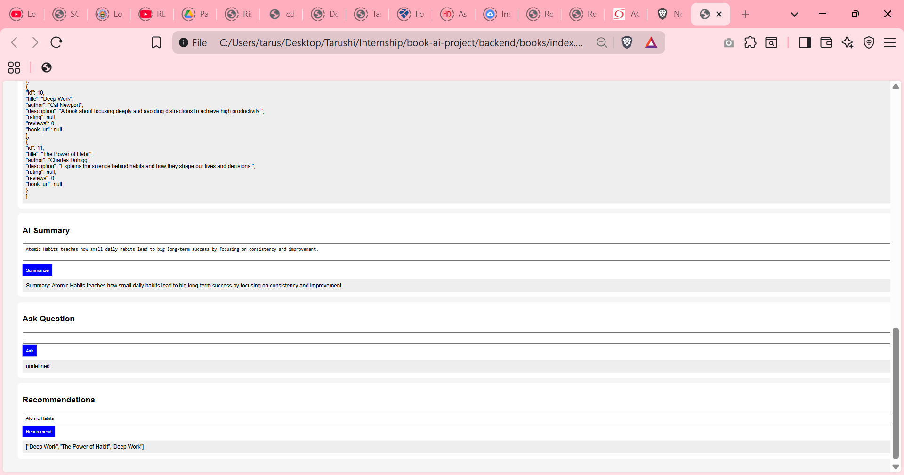

# 📚 AI Book Intelligence Platform

## 🚀 Project Overview

This project is an AI-powered Book Intelligence Platform built using Django and a simple frontend interface. It allows users to add and manage books, generate summaries using AI, and get recommendations based on stored data.

---

## 🧠 Features

### 📖 Book Management

* Add new books
* View all books

### 🤖 AI Features

* **Book Summary**: Generates summary from book description
* **Recommendation System**: Suggests similar books

---

## 🛠️ Tech Stack

* **Backend**: Django, Django REST Framework
* **Frontend**: HTML, CSS, JavaScript
* **AI Integration**: Hugging Face API (with fallback logic)

---

## ⚙️ Setup Instructions

### 1. Clone the repository

```bash
git clone https://github.com/your-username/book-ai-platform.git
cd book-ai-platform/backend
```

### 2. Create virtual environment

```bash
python -m venv venv
venv\Scripts\activate
```

### 3. Install dependencies

```bash
pip install -r requirements.txt
```

### 4. Apply migrations

```bash
python manage.py migrate
```

### 5. Run the server

```bash
python manage.py runserver
```

### 6. Open frontend

Open `frontend/index.html` in your browser

---

## 🔗 API Endpoints

* **GET** `/api/books/` → Get all books
* **POST** `/api/add-book/` → Add new book
* **POST** `/api/summarize/` → Generate summary
* **POST** `/api/recommend/` → Get recommendations

---

## 📸 Screenshots

### UI



### Add Book



### Summary



### Recommendation



---

## 💡 Future Improvements

* Improve recommendation logic using similarity algorithms
* Enhance AI model for better summaries
* Add authentication and user accounts

---

## 👩‍💻 Author

Tarushi Mahesh
